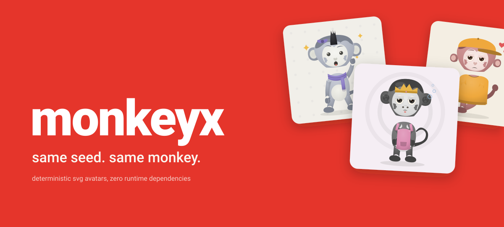

# monkeyx

Deterministic monkey avatars, generated as SVG. Any seed in, one capuchin
out, and the same seed always makes the same monkey.

[](https://github.com/nashiuso/monkeyx/actions)
[](LICENSE)
[](package.json)



monkeyx takes a name, a user id, an email, anything, and turns it into a
small svg capuchin with a face, a pose, a palette, and occasionally a
crown. No network, no dependencies, no randomness. What you see is what
the algorithm decides, and it decides the same way every time.

[api](docs/api.md) · [changelog](CHANGELOG.md) · [contributing](CONTRIBUTING.md)

## install

monkeyx is headed to npm as 0.3.0. Until the package lands, install
straight from the repository:

```sh
npm install github:nashiuso/monkeyx
```

This clones the repo and builds the package for you. When the npm release
is out, this becomes the boring `npm install monkeyx`.

## quick start

```ts
import { monkeyx } from "monkeyx";

const svg = monkeyx("nashiuso"); // a small capuchin, the same one every time
document.getElementById("avatar").innerHTML = svg;
```

Curious what the algorithm decided? `monkeyx.details(seed)` returns the
traits, palette, fingerprint, and byte count next to the svg.

## customize

Options are strictly checked. An unknown key or trait throws a typed
`ValidationError`, so a typo can never quietly produce a weird monkey.

```ts
monkeyx("bob", {
  style: "neon", // classic | soft | bold | tiny | paper | retro | night | neon
  palette: "plum",
  expression: "cheeky",
  background: "transparent",
  animation: ["idle", "blink"],

  // or pin traits by hand
  hair: "buns",
  clothing: "jacket",
});
```

`monkeyx.traits()`, `.styles()`, `.palettes()`, and `.animations()` list
every valid value at runtime, so the docs can never drift from the code.

## features

- **deterministic.** same seed + options, same bytes, forever within a
  generation version
- **a character system.** 15 trait families, 121 curated traits, about
  2×10¹³ combinations, all constrained to coherent anatomy
- **8 styles.** one anatomy, eight moods: classic, soft, bold, tiny,
  paper, retro, night, neon
- **14 animation presets.** opt-in, composable, respectful of
  `prefers-reduced-motion`
- **clean output.** transparent, solid, or gradient backgrounds; escaped,
  injection-safe svg at about 0.35 ms and 8–15 kb per avatar

The monkey is the product. The seed is the identity. Everything else is
just how the capuchin is dressed.

## faces of the same algorithm

Nine different seeds, one algorithm:


Give it a string and it answers with a monkey. Give it the same string
again and it brings back the same one.

## cli

```sh
npx monkeyx nashiuso                        # svg to stdout
npx monkeyx alice -s 128 -a blink           # sized and animated
npx monkeyx banana --style neon --trait hair=wild -o banana.svg
```

## api

`monkeyx(seed, options?)` is the whole api for most users;
`monkeyx.details(seed, options?)` hands over everything the generation
decided. Every option, error code, and `details` field lives in the
[api reference](docs/api.md).

## development

```sh
npm install
npm run verify    # typecheck, lint, format, tests, build, playground
```

Deeper reading: [architecture](docs/architecture.md) ·
[design system](docs/design-system.md) · [traits](docs/traits.md) ·
[animation](docs/animation.md) · [decisions](docs/decisions.md) ·
[release audit](docs/release-audit.md)

## contributing

Contributions welcome. [CONTRIBUTING.md](CONTRIBUTING.md) covers the
ground rules and the workflow. Security reports go through
[SECURITY.md](SECURITY.md).

## license

[BSD 3-Clause](LICENSE) © nashiuso
